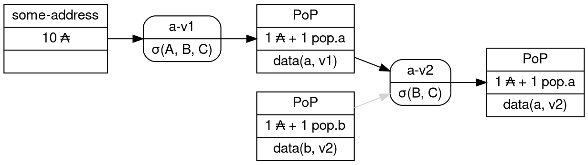

# On-chain Proof of Provenance

## Why?

* Supply-chain [attacks](https://slsa.dev/spec/v1.0/threats-overview) are becoming a significant threat as more and more critical infrastructure depends on open-source code. The [XZ attack](https://en.wikipedia.org/wiki/XZ_Utils_backdoor) is a quite recent example of a very sophisticated trojan horse injection attempt that could very well have succeeded
* This is even more a critical issue in the context of decentralised blockchains and cryptocurrencies: Compromising any piece of software could lead to stolen keys and therefore money, and as the name "supply chain" implies, it's not only and not mainly the software we produce which is at risk, but also the software we depend on, ie. the 100s of dependencies we pull in to build our stuff
* And this risk does not lie only within the core components that are running the network (eg. cardano-node) but also in every other tool that manipulates critical information (keys): wallets, command-line tools, monitoring systems, etc.
* the fact that 100% of the code is hosted by a single, centralised entity (GitHub) also implies that our software is liable to any compromission affecting GH.
* While we cannot fend off 100% of all attacks, we can at least provide verifiable information about the provenance of the software and its whole chain of dependencies so that users of the software can independently verify the software they are using is indeed the one they expect, built by the right persons and organisations

## What?

* GH provides a lot of tools to safeguard development process and recently introduced support of [SLSA](https://slsa.dev/spec/v1.0/) which is a specification to describe and attest the provenance of some piece of software
* Rather than relying on a centralised authority to store those certificates, we propose to leverage GH for producing SLSA attestations, and/or other similar kind of certificates, but host those directly on the chain in order to build a verifiable and immutable graph of dependencies attesting the origin of any piece of software
* This on-chain _attestation_ will enable anyone connected to Cardano network through a node to:
   1. lookup and verify various pieces of information about a piece of software, such as its version, the signatories for its release,  its dependency graph, its canonical URL, and the SHA of various released artifacts
   2. lookup and verify the _history_ of this software releases and the changes that occured to its team of contributors
   3. recursively verify provenance of dependencies this software depends on

### Potential Use cases & Benefits

* _Dogfood_ the development _of_ Cardano by _using_ Cardano
* Increase the level of security of the network by providing an _audit trail_ of changes occuring to core components of the network, in particular safeguarding the system against unexpected and unwanted takeover of key source code
* Safely automate infrastructure upgrades: When managing software system at scale, manually upgrading is tedious and error prone task. By publishing releases and their provenance path on-chain, it becomes safe to automatically upgrade some components
* Track progress of tools and services upgrades before or during hard-forks
* Secure or at least pinpoint potential issues in the supply-chain of the network by identifying critical 3rdparty components
* Identify contributors, both organisations and individuals, on-chain making it possible to provide financial support through the chain itself (eg. possibly coupled with something like [Drips](https://www.drips.network)?)
* Increase the security of provisioning tools, eg. [cardano-up](https://github.com/blinklabs-io/cardano-up) or [yaci-devkit](https://github.com/bloxbean/yaci-devkit) by providing a way for users to validate installed software
* Allow on-chain _Endorsement_ of published software and versions, providing a decentralised and community owned measure of reliability and "fitness-for-purpose"

## How?

### Basic principles

* A _Component_ (any piece of software that we want to track the provenance of) is identified on-chain by a dedicated _token_
* Each _Release_ of this component is represented on-chain by a single UTxO which consists in the following parts:
  * _Address_: A shared _script_ which implements on-chain controls (more on this later) as a Plutus smart contract
  * _Datum_: Metadata about the released component, notably the _Bill of Material_ or _BoM_ (more on this later)
  * _Value_: Unique token
* Releasing a new version of the component is materialised by a _Transaction_:
  * The transaction is signed by a quorum (τ) of identified _contributors_
  * It consumes the previous UTxO and creates a new one with updated metadata, subject to rules provided by the _provenance script_
  * It optionally uses [reference inputs](https://cips.cardano.org/cip/CIP-31) to identify dependencies with an on-chain representation which is part of the _Bill of Material_ and attestation attached in the output's datum

### Simple transaction flow

The following diagram illustrates a simple flow of PoP transactions:
* An initial version is created for a component _A_ through a multisigned transaction
* When v2 is released, a new transaction is published which consumes the initial version, references _B_  at version v2, and updates the data for version v2 of _A_. Note the transaction is signed by a subset of the initial signatories
* All UTxO representing current versions are held by the same script denoted `PoP`



### PoP Script

The _Proof-of-Provenance_ script controls the transformation of a component's on-chain data.

#### Datum

This on-chain data comprises:

* A _version_ following [SemVer](https://semver.org) specification,
* A _canonical URL_ ($\mu$) for the source code repository, which can be in any protocol acceptable by git,
* A _commit hash_ ($H$) pointing at the exact revision the release has been made at,
* A _set of public key hashes_ ($\Pi = \{\pi_1, \pi_2, \dots\}$) for all valid _maintainers_ of the component,
* A _quorum_ ($\tau$) of signatories required for a valid release,
* A _Merkle Tree root hash_ ($\Delta$) denoting the _Bill-of-Material_ for this release, constructed from the list of dependencies hashes (more on this later),
* A _list of artifact hashes_ ($\alpha_1, \alpha_2,  \dots$) contained in this release.

#### Validator

The PoP script enforces the following rules when part of a transaction $T$:
* The transaction must be signed by a quorum of signatories
    * $\Sigma(T) \subseteq \Pi \wedge\|\Sigma(T)\| \geq \tau$
* If the signatories, quorum or canonical URL are modified, the transaction must be signed by _all_ signatories
    *  $\Sigma(T) = \Pi$
* If other components are _referenced_, the _redeemer_ of the PoP script must contain, for each such component, a _proof of inclusion_ in the BoM Merkle-tree, eg. a valid path in the Merkle-tree for one of the referenced artifacts.
    * Let $\{\iota_1, \iota_2 \dots\}$ be the list of reference inputs to other components, and $R = \{\rho_1, \rho_2 \dots\}$ the redeemer for `PoP` script,
    * for each $i \in \{1, 2, \dots n\}$, $\exists \alpha_j^i \in \alpha(\iota_i)$ such that $(\pi_i, \alpha_j^i) \in \Delta.$
* The transaction produces one or two _PoP_ outputs, depending on the version changes:
    * In case of a _minor_ or _patch_ change, there _must_ be a single output,
    * In case of a _major_ change, there _may_ be two outputs, where one of the outputs is _unchanged_.

:::info
The rationale behind the rules for handling versions is the following:
* Let's say there's a component `A` at version `1.0` that depends on `B` at version `1.0`, which means there's been a transaction producing `A`'s UTxO referencing `B@1.0`'s UTxO
* If `B` is upgraded at version `1.1` this means the UTxO `B@1.0` is no longer available for referencing, but of course `A@1.0` is not affected
* However, if `A` is upgraded to `1.1` then it _must_ also upgrade its dependency on `B` to `1.1` because there's no more `B@1.0` to reference
* This is a way to "force" dependents to upgrade to newer minor versions which might be a good idea in general, for example to ensure security patches are applied
:::

### Off-chain data & verifications

`PoP` script is only able to _attest_ the validity of transactions that consumes and produces on-chain data. Whether or not this information is valid requires off-chain validation of the content of the data controlled by `PoP` scripts.

Using on-chain data, an observer should be able to verify the following:
* The set of signatories' public key hashes recorded in the repository at the URL and commit pointed at by the UTxO matches $\Pi$,
* The hashes of released artifacts match the list $\alpha_1, \alpha_2 \dots$ provided in the UTxO,
* The effective _Bill of Material_ needed to produce the released artifacts forms a Merkle-tree whose root matches $\Delta$.

#### Recording signatories

How the signatories' keys are recorded in the repository is an "implementation detail" and left unspecified. A possible "standard" solution is to use the `CODEOWNERS` from [GitHub](https://docs.github.com/en/repositories/managing-your-repositorys-settings-and-features/customizing-your-repository/about-code-owners#codeowners-syntax) which controls some aspects of the GitHub flow, for example as  a comment.

```
# Code owners are automatically assigned to review PRs
#
# Later rules override earlier rules.
#
# These are the
# @alice: BA6DF0F948BEB071EB8A9E4B6D3F560F1518404492767CCD36C7B47BD6294A44
# @bob: FCF3B7093F9E8D41D9165E9C4381E238AC46A7AF4D39421A7482BCC6F7D71CAB
# @charlie: 798130FA96A82E10ED0392981D7C4DAA3572AC04416BCFB09F55856F05C7DCA4

# CICD
.github/          @alice
nix/              @bob

# Haskell components
command-line/     @charlie
core/             @charlie

# JavaScript interface
jsapi/            @alice
jsbits/           @alice
```

#### Bill Of Material

There's unfortunately no single widely used _Software Bill of Material_ specification:

* SPDX[^1] is a standard supported by the Linux foundation
* CycloneDX[^2] is promoted by OWASP
* SWID[^3] is an ISO standard
* SLSA[^4] is not a SBOM standard but is supported out-of-the-box by GitHub

For the purpose of _Proof of Provenance_ and on-chain verification, the off-chain SBOM must provide the list of dependencies (possibly tracked on-chain) used to produce the artifacts of the component as binary artifacts from which a hash value can be derived to construct a Merkle-tree.


[^1]: https://spdx.dev
[^2]: https://cyclonedx.org
[^3]: https://csrc.nist.gov/projects/Software-Identification-SWID
[^4]: https://slsa.dev/
